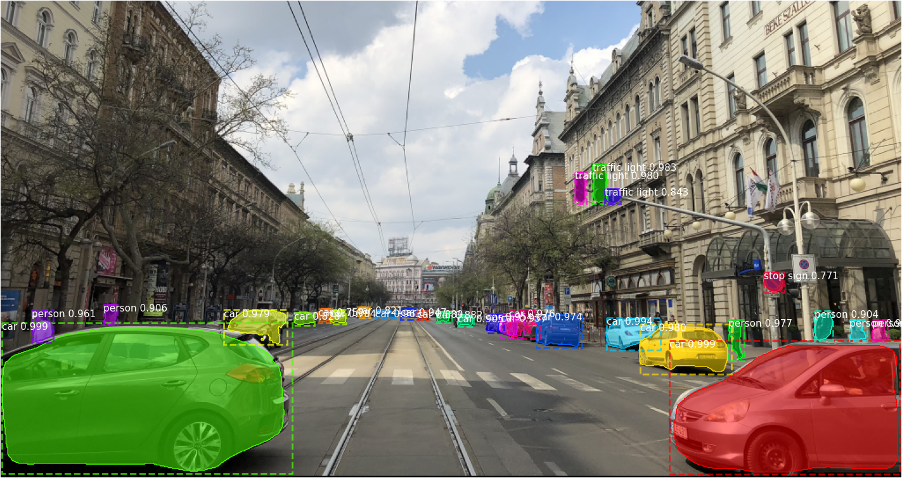

# Instance Segmentation for Traffic Participants Detection

Mask R-CNN model trained for traffic participants detection using Cityscapes dataset, using pre-trained weights on COCO dataset. Based on [Matterport Mask R-CNN](https://github.com/matterport/Mask_RCNN) implementation, adapted for Python 3.7.0, Tensorflow 2.0.0 and Keras 2.3.1.

The repository includes:
- Training code for Cityscapes
- Inference code for prediction on unseen data
- Pre-trained weights for Cityscapes
- Evaluation on MS COCO metrics
- Demo app 


## Setup
1. Clone this repository

2. Install packages listed in requirements.txt

```
pip install -r src/requirements.txt
```

3. Download pre-trained Mask R-CNN COCO weights (mask_rcnn_coco.h5) from the [Matterport Mask R-CNN](https://github.com/matterport/Mask_RCNN/releases/download/v2.0/mask_rcnn_coco.h5) page and place it into the `src/model/resources` directory.

4. Download [Cityscapes](https://www.cityscapes-dataset.com/downloads/) dataset images and annotation files, and place them into `src/model/resources` directory. The final structure should look like this:
```
+ src
  + model
    + resources
      + annotations
        + test
        + train
        + val
      + dataset
        + test
        + train
        + val
      labels.txt
      mask_rcnn_coco.h5
```

## Training and inference
1. Run the training script with parameters for data, labels and weights paths
```
python main_train.py -d=/instance-segmentation-mask-rcnn/src/model/resources -l=/instance-segmentation-mask-rcnn/src/model/resources/labels.txt -w=/instance-segmentation-mask-rcnn/src/model/resources/mask_rcnn_coco.h5
```

2. Run the predict script with parameters for the input image, labels and trained model weights paths
```
python main_predict.py -i=/images/your_image.png -l=/instance-segmentation-mask-rcnn/src/model/resources/labels.txt -w=/instance-segmentation-mask-rcnn/src/model/resources/mask_rcnn_cityscapes.h5
```

## Result Example

